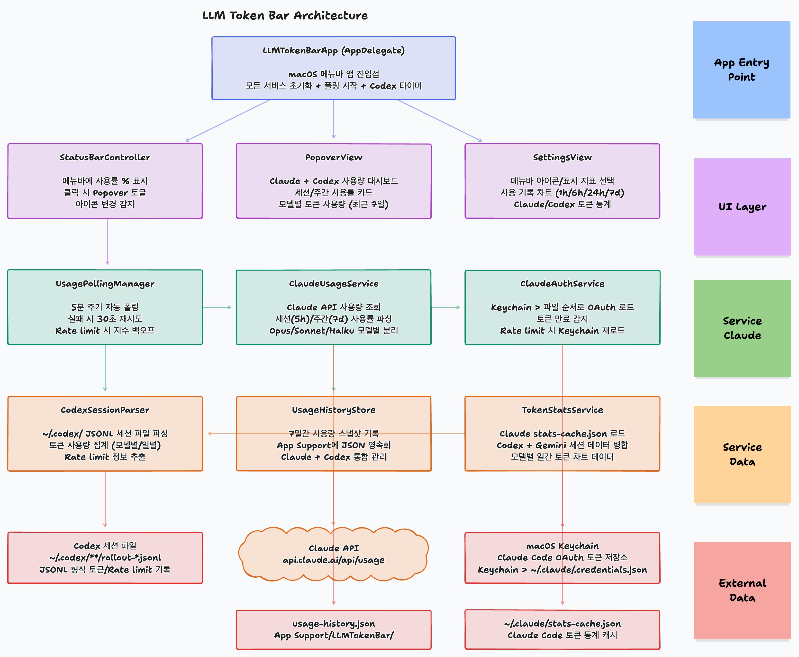

# LLM Token Bar

macOS 메뉴바에서 Claude, Codex, Gemini의 토큰 사용량을 실시간으로 모니터링하는 앱입니다.

## Features

- **메뉴바 사용률 표시** - 세션/주간/모델별 사용률을 메뉴바에 % 로 표시
- **Claude OAuth 사용량 조회** - 5시간 세션, 7일 주간, Opus/Sonnet/Haiku 모델별 사용률
- **Codex 세션 파싱** - `~/.codex/` 세션 파일에서 토큰 사용량 및 Rate limit 추출
- **Gemini 세션 파싱** - `~/.gemini/` 세션 파일에서 토큰 사용량 추출
- **사용 기록 차트** - 1h/6h/24h/7d 범위의 사용량 추이 그래프
- **모델별 토큰 통계** - Claude Code `stats-cache.json` 기반 일간 토큰 차트

## Screenshots

> TODO: 앱 스크린샷 추가

## Architecture



### Layers

| Layer | Components | Description |
|-------|-----------|-------------|
| **App Entry Point** | `LLMTokenBarApp` | macOS 메뉴바 앱 진입점, 서비스 초기화 및 폴링 시작 |
| **UI Layer** | `StatusBarController`, `PopoverView`, `SettingsView` | 메뉴바 아이콘, 사용량 대시보드, 설정 화면 |
| **Service (Claude)** | `UsagePollingManager`, `ClaudeUsageService`, `ClaudeAuthService` | Claude API 폴링, 사용량 조회, OAuth 인증 |
| **Service (Data)** | `CodexSessionParser`, `UsageHistoryStore`, `TokenStatsService` | Codex/Gemini 세션 파싱, 사용량 기록, 토큰 통계 |
| **External Data** | Claude API, macOS Keychain, 세션 파일들 | 외부 데이터 소스 |

### Polling Strategy

| 상태 | 간격 |
|------|------|
| 성공 | 10분 |
| 실패 | 5분 |
| Rate limit | 10분 기반 지수 백오프 (최대 30분) |
| 429 일시적 | 3초 후 1회 자동 재시도 |

### Authentication Flow

1. **앱 자체 Keychain** 에서 캐싱된 토큰 조회 (프롬프트 없음)
2. 없거나 만료 시 `~/.claude/.credentials.json` **파일**에서 읽기 (프롬프트 없음)
3. Last resort: **Claude Code Keychain** (`Claude Code-credentials`)에서 읽기 (macOS 권한 팝업 가능)
4. 읽은 토큰은 앱 자체 Keychain에 캐싱하여 이후 프롬프트 방지

> 앱은 토큰을 refresh하지 않습니다. 토큰 만료 시 Claude Code CLI에서 다시 로그인해야 합니다.

## Requirements

- macOS 14.0+
- Swift 6.0
- [XcodeGen](https://github.com/yonaskolb/XcodeGen)

## Build

```bash
# 프로젝트 생성 및 빌드
xcodegen generate
xcodebuild -project LLMTokenBar.xcodeproj -scheme LLMTokenBar -configuration Debug build

# 테스트
xcodebuild -project LLMTokenBar.xcodeproj -scheme LLMTokenBar test
```

## Project Structure

```
LLMTokenBar/
├── LLMTokenBarApp.swift          # 앱 진입점
├── Models/
│   ├── Provider.swift            # LLM 프로바이더 enum
│   ├── UsageData.swift           # 사용량 데이터 모델
│   ├── UsageHistory.swift        # 사용 기록 모델
│   ├── TokenStats.swift          # 토큰 통계 모델
│   └── Credentials.swift         # OAuth 자격증명 모델
├── Services/
│   ├── ClaudeAuthService.swift   # Claude OAuth 인증
│   ├── ClaudeUsageService.swift  # Claude API 사용량 조회
│   ├── UsagePollingManager.swift # 자동 폴링 관리
│   ├── UsageHistoryStore.swift   # 사용 기록 저장
│   ├── TokenStatsService.swift   # 토큰 통계 서비스
│   ├── CodexSessionParser.swift  # Codex 세션 파싱
│   ├── GeminiSessionParser.swift # Gemini 세션 파싱
│   └── KeychainService.swift     # Keychain 접근
├── Views/
│   ├── StatusBarController.swift # 메뉴바 컨트롤러
│   ├── PopoverView.swift         # 메인 팝오버 UI
│   ├── SettingsView.swift        # 설정 화면
│   ├── UsageCardView.swift       # 사용량 카드 컴포넌트
│   ├── UsageHistoryView.swift    # 사용 기록 차트
│   ├── TokenStatsView.swift      # 토큰 통계 뷰
│   ├── OpenAISettingsView.swift  # Codex 설정
│   └── GeminiSettingsView.swift  # Gemini 설정
└── Utilities/
    ├── Constants.swift           # 상수 정의
    └── TimeFormatter.swift       # 시간 포맷 유틸리티
```

## License

MIT
