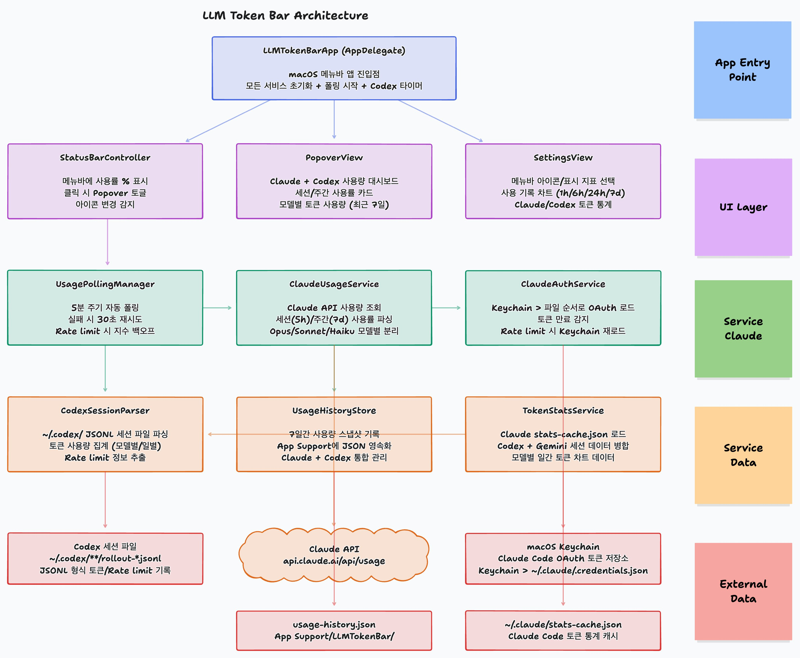

# LLM Token Bar

macOS 메뉴바에서 Claude, Codex, Gemini의 토큰 사용량을 실시간으로 모니터링하는 앱입니다.

## Features

- **메뉴바 사용률 표시** - 세션/주간/모델별 사용률을 메뉴바에 % 로 표시
- **Claude OAuth 사용량 조회** - 5시간 세션, 7일 주간, 서버가 제공하는 Fable 주간 사용률
- **Codex 세션 파싱** - `~/.codex/` 세션 파일에서 토큰 사용량 및 Rate limit 추출
- **Antigravity 사용량 조회** - `agy --print /usage`로 Gemini 및 Claude·GPT의 5시간·주간 사용률 조회
- **사용 기록 차트** - 1h/6h/24h/7d 범위의 사용량 추이 그래프
- **모델별 토큰 통계** - Claude Code `stats-cache.json` 기반 일간 토큰 차트

## Screenshots

> TODO: 앱 스크린샷 추가

## Architecture



### Layers

| Layer | Components | Description |
|-------|-----------|-------------|
| **App Entry Point** | `LLMTokenBarApp` | macOS 메뉴바 앱 진입점, 서비스 초기화 및 폴링 시작 |
| **UI Layer** | `StatusBarController`, `PopoverView`, `SettingsView` | 메뉴바 아이콘, 사용량 대시보드, 설정 화면 |
| **Service (Claude)** | `UsagePollingManager`, `ClaudeUsageService`, `ClaudeAuthService` | Claude API 폴링, 사용량 조회, OAuth 인증 |
| **Service (Data)** | `CodexSessionParser`, `UsageHistoryStore`, `TokenStatsService` | Codex 세션 파싱, 사용량 기록, 토큰 통계 |
| **Service (Antigravity)** | `AntigravityCLIQuotaClient`, `AntigravityQuotaStore` | agy 사용량 명령 실행, 보고서 파싱, 한도 표시 |
| **External Data** | Claude API, macOS Keychain, 세션 파일들, agy CLI | 외부 데이터 소스 |

### Polling Strategy

| 상태 | 간격 |
|------|------|
| 성공 | 10분 |
| 실패 | 5분 |
| Rate limit | 10분 기반 지수 백오프 (최대 30분) |
| 429 일시적 | 3초 후 1회 자동 재시도 |

### Authentication Flow

1. **앱 자체 파일 캐시** (`~/Library/Application Support/LLMTokenBar/claude-oauth-cache.json`) 에서 캐싱된 토큰 조회
2. 없거나 만료 시 `~/.claude/.credentials.json` **파일**에서 읽기
3. Last resort: **Claude Code Keychain** (`Claude Code-credentials`)에서 읽기 (macOS 권한 팝업 가능)
4. 읽은 토큰은 앱 자체 파일 캐시에 저장하여 이후 접근 비용을 줄임

> 앱은 토큰을 refresh하지 않습니다. 토큰 만료 시 Claude Code CLI에서 다시 로그인해야 합니다.

## Requirements

- macOS 14.0+
- Swift 6.0
- [XcodeGen](https://github.com/yonaskolb/XcodeGen)
- Antigravity 한도 조회를 사용하려면 agy CLI 설치 및 로그인 필요

### Antigravity 사용량 확인

터미널에서 `agy --print /usage`가 정상적으로 실행되는지 먼저 확인합니다. 앱은 이 명령의 잔여 비율을 사용 비율로 변환합니다. 예를 들어 잔여량 100%는 사용량 0%입니다. 인증 파일이나 CSRF 토큰을 앱에 복사할 필요는 없습니다.

Antigravity 자동 조회 주기는 5분입니다. 팝오버를 열거나 새로고침 버튼을 누르면 바로 조회합니다.

실제 CLI를 호출하는 통합 테스트는 기본 실행에서 제외됩니다. 설치된 agy로 검증하려면 다음 명령을 실행합니다.

```bash
xcodegen generate
LLM_TOKEN_BAR_LIVE_AGY=1 TEST_RUNNER_LLM_TOKEN_BAR_LIVE_AGY=1 xcodebuild \
  -project LLMTokenBar.xcodeproj -scheme LLMTokenBar \
  -only-testing:LLMTokenBarTests/AntigravityCLIQuotaClientLiveTests \
  CODE_SIGNING_ALLOWED=NO CODE_SIGNING_REQUIRED=NO CODE_SIGN_IDENTITY="" test
```

## Build

```bash
# 프로젝트 생성 및 빌드
xcodegen generate
xcodebuild -project LLMTokenBar.xcodeproj -scheme LLMTokenBar -configuration Debug build

# 테스트
xcodebuild -project LLMTokenBar.xcodeproj -scheme LLMTokenBar test
```

## Project Structure

```
LLMTokenBar/
├── LLMTokenBarApp.swift          # 앱 진입점
├── Models/
│   ├── Provider.swift            # LLM 프로바이더 enum
│   ├── UsageData.swift           # 사용량 데이터 모델
│   ├── UsageHistory.swift        # 사용 기록 모델
│   ├── TokenStats.swift          # 토큰 통계 모델
│   └── Credentials.swift         # OAuth 자격증명 모델
├── Services/
│   ├── ClaudeAuthService.swift   # Claude OAuth 인증
│   ├── ClaudeUsageService.swift  # Claude API 사용량 조회
│   ├── UsagePollingManager.swift # 자동 폴링 관리
│   ├── UsageHistoryStore.swift   # 사용 기록 저장
│   ├── TokenStatsService.swift   # 토큰 통계 서비스
│   ├── CodexSessionParser.swift  # Codex 세션 파싱
│   ├── AntigravityCLIQuotaClient.swift # agy 한도 조회
│   └── KeychainService.swift     # Keychain 접근
├── Views/
│   ├── StatusBarController.swift # 메뉴바 컨트롤러
│   ├── PopoverView.swift         # 메인 팝오버 UI
│   ├── SettingsView.swift        # 설정 화면
│   ├── UsageCardView.swift       # 사용량 카드 컴포넌트
│   ├── UsageHistoryView.swift    # 사용 기록 차트
│   ├── TokenStatsView.swift      # 토큰 통계 뷰
│   ├── OpenAISettingsView.swift  # Codex 설정
│   └── GeminiSettingsView.swift  # Gemini 설정
└── Utilities/
    ├── Constants.swift           # 상수 정의
    └── TimeFormatter.swift       # 시간 포맷 유틸리티
```

## License

MIT
